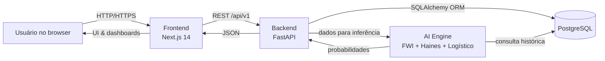

# 🌿 EcoMonitor — Plataforma Preditiva de Riscos Ambientais

O **EcoMonitor** é um sistema web completo para monitorar focos de incêndio, gerar análises preditivas e apoiar a tomada de decisão com base em dados ambientais. A solução combina:

- Frontend **Next.js 14 (App Router) + React Query + Tailwind**
- Backend **FastAPI** com orquestração via **Docker Compose**
- Banco de dados **PostgreSQL**
- Motor de IA com ensemble de modelos científicos (FWI, Haines e regressão logística)

---

## 🚀 Comece em poucos minutos

<details>
<summary><strong>✅ Passo a passo rápido</strong></summary>

1. **Clone o repositório**

   ```bash
   git clone <url-do-repositorio>
   cd EcoBrasil
   ```

2. **Instale as dependências do frontend**

   ```bash
   npm install
   ```

3. **Suba backend + banco com Docker**

   ```bash
   ./start.sh
   ```

   - API: `http://localhost:8000`
   - Docs (Swagger): `http://localhost:8000/docs`
   - Banco: `localhost:5432`

4. **(Opcional – primeira carga)** Migre os dados históricos:

   ```bash
   docker-compose exec backend python migrate_data.py
   ```

5. **Rode o frontend Next.js**

   ```bash
   npm run dev
   ```

   - Interface: `http://localhost:3000`

6. **Encerrar serviços**
   ```bash
   docker-compose down --remove-orphans
   ```

</details>

---

## 🖥️ Requisitos

<details>
<summary><strong>📦 Software necessário</strong></summary>

- **Docker Desktop** 20.10+
- **Node.js** 18+ (recomendado 20+)
- **Git**

<em>O Python 3.11 é necessário apenas se você quiser executar o backend fora do Docker.</em>

</details>

<details>
<summary><strong>🛠️ Solução de problemas comuns</strong></summary>

- **Docker não inicia**
  ```bash
  docker info
  sudo systemctl restart docker   # Linux
  ```
- **Porta em uso**
  ```bash
  lsof -i :3000
  lsof -i :8000
  kill -9 <PID>
  ```
- **Permissões no Docker (Linux)**
  ```bash
  sudo usermod -aG docker $USER
  ```
- **Reset rápido**
  ```bash
  docker-compose down --remove-orphans
  docker system prune -f
  ```

</details>

---

## 🧭 Fluxo do sistema

<details>
<summary><strong>🔀 Diagrama Mermaid</strong></summary>



</details>

---

## 🔬 Como a análise preditiva funciona

<details>
<summary><strong>🧮 Ensemble de modelos</strong></summary>

### 1. Fire Weather Index (FWI)

%20+%200.45%20\cdot%20(BUI%20-%2050))

- `ISI`: depende da velocidade do vento  
- `BUI`: combina umidade e temperatura (FFMC, DMC, DC)

---

### 2. Índice Haines

%20+%20(T_{850}%20-%20T_{d,850}))

Mede a instabilidade atmosférica em níveis médios.

---

### 3. Modelo logístico sazonal

%20+%201.5\frac{F}{100}%20+%200.8\frac{V}{30}%20+%201.2(S-1))
  


- `T`: temperatura (°C)  
- `U`: umidade relativa (%)  
- `F`: nível de fumaça (%)  
- `V`: velocidade do vento (km/h)  
- `S`: fator sazonal  

---

### 4. Ensemble final

%20+%200.3(16.67%20\cdot%20H)%20+%20\Delta))
  


Esses valores alimentam a página **Análise Preditiva** e o **Dashboard**.

</details>


---

## ⚙️ Arquitetura & Stack

- **Frontend:** Next.js 14 (App Router), React 18, Tailwind CSS, React Query
- **Backend:** FastAPI, SQLAlchemy, Pydantic
- **IA:** NumPy, SciPy, modelos físicos (FWI/Haines) + regressão logística
- **Banco:** PostgreSQL 15
- **Infra:** Docker Compose, scripts `start.sh` / `stop.sh`

---

## 🗂️ Estrutura do projeto

```
EcoBrasil/
├── app/                # Rotas e páginas Next.js (App Router)
├── components/         # UI e layout reutilizáveis
├── lib/                # Clients, helpers e providers
├── backend/            # API FastAPI + IA
├── database/           # Seeds e CSVs de ingestão
├── public/             # Assets estáticos do frontend
├── start.sh / stop.sh  # Scripts para orquestração Docker
├── docker-compose.yml  # Backend + PostgreSQL
└── README.md
```

---

## 📡 Endpoints principais

- `GET /api/v1/monitoring/points` — pontos monitorados
- `GET /api/v1/monitoring/stats` — métricas agregadas
- `POST /api/v1/predictions/fire-risk` — cálculo de risco
- `GET /api/v1/alerts/` — alertas ativos
- `PUT /api/v1/alerts/{id}/status` — atualizar status de alerta
- `GET /docs` — documentação interativa (Swagger)

---

## 📄 Licença

Distribuído sob a **MIT License** — veja o arquivo [LICENSE](LICENSE).

---

**EcoMonitor v2.0 — Arquitetura moderna com IA aplicada a riscos ambientais.** 🔥
