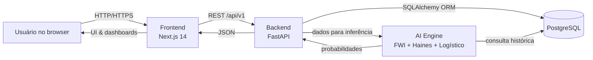

# 🌿 EcoMonitor — Plataforma Preditiva de Riscos Ambientais

O **EcoMonitor** é um sistema web completo para monitorar focos de incêndio, gerar análises preditivas e apoiar a tomada de decisão com base em dados ambientais. A solução combina:

- Frontend **Next.js 14 (App Router) + React Query + Tailwind**
- Backend **FastAPI** com orquestração via **Docker Compose**
- Banco de dados **PostgreSQL**
- Motor de IA com ensemble de modelos científicos (FWI, Haines e regressão logística)

---

## 🚀 Comece em poucos minutos

<details>
<summary><strong>✅ Passo a passo rápido</strong></summary>

1. **Clone o repositório**

   ```bash
   git clone <url-do-repositorio>
   cd EcoBrasil
   ```

2. **Instale as dependências do frontend**

   ```bash
   npm install
   ```

3. **Suba backend + banco com Docker**

   ```bash
   ./start.sh
   ```

   - API: `http://localhost:8000`
   - Docs (Swagger): `http://localhost:8000/docs`
   - Banco: `localhost:5432`

4. **(Opcional – primeira carga)** Migre os dados históricos:

   ```bash
   docker-compose exec backend python migrate_data.py
   ```

5. **Rode o frontend Next.js**

   ```bash
   npm run dev
   ```

   - Interface: `http://localhost:3000`

6. **Encerrar serviços**
   ```bash
   docker-compose down --remove-orphans
   ```

</details>

---

## 🖥️ Requisitos

<details>
<summary><strong>📦 Software necessário</strong></summary>

- **Docker Desktop** 20.10+
- **Node.js** 18+ (recomendado 20+)
- **Git**

<em>O Python 3.11 é necessário apenas se você quiser executar o backend fora do Docker.</em>

</details>

<details>
<summary><strong>🛠️ Solução de problemas comuns</strong></summary>

- **Docker não inicia**
  ```bash
  docker info
  sudo systemctl restart docker   # Linux
  ```
- **Porta em uso**
  ```bash
  lsof -i :3000
  lsof -i :8000
  kill -9 <PID>
  ```
- **Permissões no Docker (Linux)**
  ```bash
  sudo usermod -aG docker $USER
  ```
- **Reset rápido**
  ```bash
  docker-compose down --remove-orphans
  docker system prune -f
  ```

</details>

---

## 🧭 Fluxo do sistema

<details>
<summary><strong>🔀 Diagrama Mermaid</strong></summary>



</details>

---

## 🔬 Como a análise preditiva funciona

<details>
<summary><strong>🧮 Ensemble de modelos</strong></summary>

### 1. Fire Weather Index (FWI)

O FWI segue o padrão canadense de combate a incêndios e utiliza três sub‑índices:

- **FFMC** (Fine Fuel Moisture Code) → sensibilidade do material fino:  
  `FFMC = 85 + 0.0365 × temperatura − 0.0365 × umidade` (limitado a 0‒101)
- **DMC** (Duff Moisture Code) → umidade de camada intermediária:  
  `DMC = max(0, 20 + 0.5 × temperatura − 0.2 × umidade)`
- **DC** (Drought Code) → seca de longo prazo:  
  `DC = max(0, 50 + 0.8 × temperatura − 0.3 × umidade)`

Com esses componentes o motor calcula:

$$
ISI = 0.208 \cdot FFMC \cdot \left(1 + \frac{vento}{10}\right)
$$

$$
BUI = \frac{0.8 \cdot DMC \cdot DC}{DMC + 0.4 \cdot DC}
$$

$$
FWI =
\begin{cases}
2.0 \cdot \ln(ISI + 1) + 0.45 \cdot (BUI - 50), & \text{se } BUI \leq 80 \\
2.0 \cdot \ln(ISI + 1) + 0.45 \cdot (BUI - 50) + 0.1 \cdot (BUI - 80), & \text{caso contrário}
\end{cases}
$$

### 2. Índice Haines

O índice Haines captura instabilidade atmosférica em níveis médios, combinando gradiente térmico e déficit de umidade:

$$
H = (T_{850} - T_{700}) + (T_{850} - T_{d,850})
$$

- \(T\_{850}\): temperatura simulada a 850 hPa (usamos temperatura de superfície)
- \(T*{700}\): temperatura aproximada a 700 hPa (`T*{850} - 10`)
- \(T\_{d,850}\): temperatura de ponto de orvalho derivada da umidade relativa

O resultado é truncado em \([0, 6]\), conforme a escala operacional do índice.

### 3. Modelo logístico sazonal

Para capturar comportamentos regionais o backend normaliza cada variável de entrada:

- \(T_n = \frac{T}{50}\) — temperatura (°C) convertida para faixa 0‒1
- \(U_n = 1 - \frac{U}{100}\) — risco associado à baixa umidade
- \(F_n = \frac{F}{100}\) — nível de fumaça (0‒100%)
- \(V_n = \frac{V}{30}\) — velocidade do vento (km/h) escalonada
- \(S\) — fator sazonal tabelado (maior nas estações secas)

A regressão logística calibrada produz:

$$
z = -2.5 + 3.2T_n + 2.8U_n + 1.5F_n + 0.8V_n + 1.2(S - 1)
$$

$$
P_{\text{log}} = \frac{1}{1 + e^{-z}} \times 100
$$

### 4. Ensemble e ajuste bayesiano

O escore final combina os três modelos (ponderação empírica validada em dados históricos):

$$
P_{\text{ensemble}} = 0.4 P_{\text{log}} + 0.3 \min(100, 10 \cdot FWI) + 0.3 \min(100, 16.67 \cdot H)
$$

Em seguida é aplicado um ajuste por densidade de ocorrências críticas na região analisada:

$$
\Delta = 15 \cdot \frac{N_{\text{crit}}}{N_{\text{total}}} + 8 \cdot \frac{N_{\text{alto}}}{N_{\text{total}}}
$$

$$
P_{\text{final}} = \min\left(100,\; P_{\text{ensemble}} + \Delta\right)
$$

Esse valor é exposto na API e alimenta o dashboard, sempre acompanhado dos componentes médios (`fwi_medio`, `haines_medio`, `ensemble_score`) retornados pelo endpoint `/predictions/fire-risk`.

</details>

---

## ⚙️ Arquitetura & Stack

- **Frontend:** Next.js 14 (App Router), React 18, Tailwind CSS, React Query
- **Backend:** FastAPI, SQLAlchemy, Pydantic
- **IA:** NumPy, SciPy, modelos físicos (FWI/Haines) + regressão logística
- **Banco:** PostgreSQL 15
- **Infra:** Docker Compose, scripts `start.sh` / `stop.sh`

---

## 🗂️ Estrutura do projeto

```
EcoBrasil/
├── app/                # Rotas e páginas Next.js (App Router)
├── components/         # UI e layout reutilizáveis
├── lib/                # Clients, helpers e providers
├── backend/            # API FastAPI + IA
├── database/           # Seeds e CSVs de ingestão
├── public/             # Assets estáticos do frontend
├── start.sh / stop.sh  # Scripts para orquestração Docker
├── docker-compose.yml  # Backend + PostgreSQL
└── README.md
```

---

## 📡 Endpoints principais

- `GET /api/v1/monitoring/points` — pontos monitorados
- `GET /api/v1/monitoring/stats` — métricas agregadas
- `POST /api/v1/predictions/fire-risk` — cálculo de risco
- `GET /api/v1/alerts/` — alertas ativos
- `PUT /api/v1/alerts/{id}/status` — atualizar status de alerta
- `GET /docs` — documentação interativa (Swagger)

---

## 📄 Licença

Distribuído sob a **MIT License** — veja o arquivo [LICENSE](LICENSE).

---

**EcoMonitor v2.0 — Arquitetura moderna com IA aplicada a riscos ambientais.** 🔥
