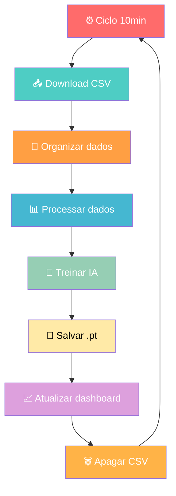

# Fluxo de Treinamento da IA - Sistema de Monitoramento de Incêndios

## Diagrama do Processo Automatizado

## Resumo do Fluxo

🔄 **Ciclo Automatizado de 10 minutos:**
1. 📥 Baixa dados CSV de incêndios
2. 🔧 Organiza dados via programa
3. 📊 Processa e limpa os dados
4. 🧠 Treina modelo neural
5. 💾 Salva pesos em arquivo `.pt`
6. 📈 Atualiza dashboard
7. 🗑️ Remove CSVs para economizar espaço
8. ⏰ Repete o ciclo

## Benefícios
- ✅ **Totalmente automatizado**
- 🚀 **Dados sempre atualizados**
- 💡 **IA em constante aprendizado**
- 🎯 **Dashboard em tempo real**